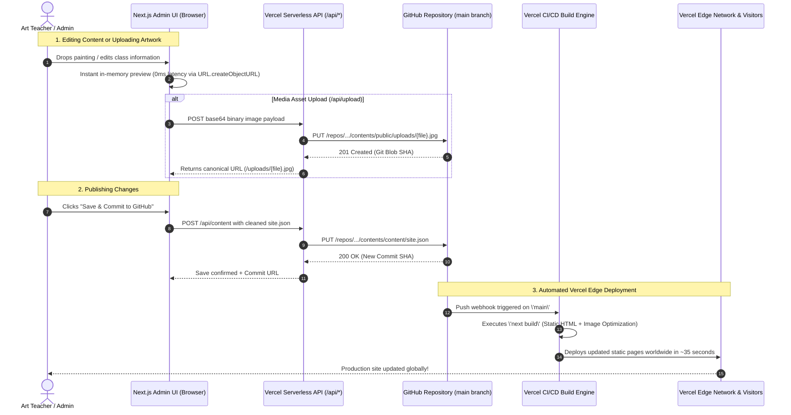

<div align="center">

# 🎨 Jeeva Art School

**Traditional Fine Arts Academy • Bengaluru, India • Teaching Since 2005**

[](https://nextjs.org/)
[](https://react.dev/)
[](https://www.typescriptlang.org/)
[](https://tailwindcss.com/)
[](https://www.framer.com/motion/)
[](https://vercel.com/)
[](#)

[🌐 Visit Live Website](https://jeevaarts.com) • [🎨 Admin Portal](#-admin-cms-portal--studio) • [📐 Architecture](#-system-architecture) • [🚀 Deployment](#-deployment-on-vercel)

</div>

---

## 📖 About Jeeva Art School

Founded in 2005 in Bengaluru by master artist **Jeeva**, Jeeva Art School is a premier fine arts academy nurturing artists from young beginners to advanced diploma and government examination candidates. 

The curriculum spans across six core visual arts disciplines:
- **Pencil & Charcoal Shading**: Hyper-detailed tonal rendering, anatomical cross-hatching, and chiaroscuro.
- **Watercolours**: Fluid atmospheric washes, translucent glazing, and organic landscapes.
- **Acrylic Painting**: Expressive impasto techniques, textured palette knife work, and vivid realism.
- **Oil Painting**: Classical multi-layered compositions, wet-on-wet blending, and depth modeling.
- **Traditional Tanjore Painting**: Sacred iconography crafted with 22-karat genuine gold foil, embossed relief gesso work, and Jaipur gem embellishments.
- **Emerging Artists Foundation**: Comprehensive creative coursework guiding children and adults from foundational mark-making to portfolio exhibitions.

---

## 📐 System Architecture

The website is engineered as a **Git-backed Headless CMS** running on **Next.js** and deployed to **Vercel\'s Global Edge Network**, using **GitHub** as the single source of truth for both content (`content/site.json`) and media assets (`public/uploads/*`).

### 🔄 End-to-End Data & Deployment Flow



---

## 🖼️ How Assets & Images Are Stored and Served

### The Challenge with Serverless Deployments
On platforms like Vercel, serverless lambdas have an **ephemeral and read-only filesystem (`EROFS`)**. Any file written to the local server disk disappears immediately when the serverless function terminates.

### The Solution: Direct GitHub Repository Asset Persistence
1. **Zero-Lag Visual Feedback (0ms)**:
   When the teacher drops or selects an artwork, `SiteContext` immediately creates an in-memory Object URL (`URL.createObjectURL(file)`). The painting renders in the UI immediately without waiting for network round-trips.
2. **Binary Commit via GitHub Contents API (`/api/upload`)**:
   The image is converted to base64 and processed by `pages/api/upload.ts`. It invokes `commitBinaryFile` in `lib/github.ts`, which safely writes the binary buffer directly to `public/uploads/{timestamp}-{filename}.jpg` in the GitHub repository.
3. **Zero-404 Fallback Rewrite (`next.config.js`)**:
   Because Vercel takes ~30–45 seconds to rebuild, newly committed images in GitHub don\'t exist in Vercel\'s static container yet. A custom fallback rewrite routes missing `/uploads/:path*` requests directly to GitHub\'s raw CDN (`raw.githubusercontent.com`):
   ```javascript
   // next.config.js
   async rewrites() {
     return {
       fallback: [
         {
           source: "/uploads/:path*",
           destination: \`https://raw.githubusercontent.com/\${owner}/\${repo}/\${branch}/public/uploads/:path*\`,
         },
       ],
     };
   }
   ```
4. **Vercel Edge Image Optimization**:
   Once Vercel finishes rebuilding, Next.js serves the asset locally from Vercel\'s edge cache, automatically converting it on the fly to responsive, highly compressed **AVIF and WebP** formats (reducing 3MB camera photos to crisp ~40KB assets).
5. **Canonical Path Sanitization**:
   When saving `content/site.json`, the client automatically strips temporary browser blob URLs (`blob:http:...`) and commits only permanent canonical paths (`/uploads/...`), preventing data leaks.

---

## ✨ Features & Enhancements

### 1. 🖼️ Dynamic Hero Artwork Showcase
* Curated showcase of **30 original artworks** spanning all mediums (Pencil, Acrylic, Oil, Tanjore, Watercolour, and Student studies).
* Smooth randomized transitions powered by Framer Motion:
  * **Roll-up**: Vertical upward stage glide with spring deceleration.
  * **Fade**: Soft atmospheric exposure cross-dissolve.
  * **Dissolve**: Subtle scale-in with layered opacity shift.
  * **Swipe**: Horizontal carousel glide.
* **Bottom-Right Player Controls**: Previous, Next, Pause/Play autoplay toggle, and quick "Enlarge" modal trigger.
* **Pre-Warmed Assets**: Images in the queue are preloaded into browser memory (`lib/preload.ts`) to eliminate blank flashes during cycling.

### 2. 📱 Mobile-Adaptive Responsive Layout
* **Smart Aspect Ratio Detection**:
  * **Portrait Paintings**: Scaled to **50% card width**, centered horizontally, with `3:4` ratio and `object-contain` so the full composition (e.g. Tanjore deity thrones, standing portraits) is never cropped.
  * **Landscape Paintings**: Rendered at full card width with `object-cover` to maximize screen real estate.
* **Touch-Optimized Typography**: Enhanced font scale and comfortable touch targets on iPhone and Android viewports.

### 3. 🌟 Painterly Chromatic Halo
* Replaced legacy concentric SVG circles with an organic, morphing watercolor chromatic aura centered behind the master portrait.
* **Zero Top Cutoff**: Bounded cleanly within viewport proportions (`w-[200px] h-[200px]` mobile / `w-[240px] h-[240px]` desktop) so it never clips against the header.
* Features six orbiting pigment beads representing key atelier colors:
  * 🟡 *Tanjore Gold* (`#eab308`)
  * 🔴 *Rose Madder* (`#f43f5e`)
  * 🔵 *Cerulean Sky* (`#0ea5e9`)
  * 🟢 *Viridian Emerald* (`#10b981`)
  * 🟣 *Amethyst Plum* (`#a855f7`)
  * 🔷 *Lapis Ultramarine* (`#3b82f6`)

### 4. 📞 Direct Call & WhatsApp CTA
* Interactive emerald **"Call +91 99450 67101"** button featuring an animated phone wobble on hover (`rotate: [0, -18, 18, -12, 12, -6, 6, 0]`).
* Direct **"Message on WhatsApp"** button connecting visitors directly to admissions.

### 5. 🎛️ Admin CMS Portal & Studio
* **In-Page Live Visual Editor**: Toggle edit mode directly on the homepage with real-time WYSIWYG editing of titles, fees, timings, gallery captions, and contact information.
* **Mass Upload Studio (`/admin/studio`)**: Bulk upload interface for adding dozens of student paintings with instant medium tagging and automatic batch commitment to GitHub.
* **Conflict-Resilient Commits**: Automatic retry logic in `lib/github.ts` handling Git 409 SHA conflicts gracefully.

---

## 🛠️ Tech Stack

| Layer | Technology | Purpose |
|---|---|---|
| **Framework** | Next.js 13.1 (Pages Router) | Hybrid static-site generation (SSG) & serverless API routes |
| **Language** | TypeScript 4.9 | Strict type safety for content schemas and gallery structures |
| **Styling** | Tailwind CSS 3.2 | Utility-first responsive design, dark mode, and custom palette |
| **Animation** | Framer Motion 9.0 + Anime.js | Fluid layout morphs, modal physics, and halo animations |
| **Typography** | `@next/font/google` | Zero-layout-shift loading of *Cormorant Garamond* and *Outfit* |
| **Icons** | FontAwesome 6 Free SVG | Vector iconography for mediums, contact, and player controls |
| **Hosting** | Vercel Edge Platform | Serverless compute, global CDN, and automated Git CI/CD |
| **Persistence** | GitHub REST Contents API | Git-backed persistence for media assets and site content |

---

## 🚀 Getting Started Locally

### Prerequisites
- Node.js 20.x or higher
- npm or yarn

### Installation
1. Clone the repository:
   ```bash
   git clone https://github.com/abhay2008/JeevaArtSchool.git
   cd JeevaArtSchool
   ```

2. Install dependencies:
   ```bash
   npm install
   ```

3. Configure environment variables:
   Copy `.env.example` to `.env.local`:
   ```bash
   cp .env.example .env.local
   ```
   Fill in your GitHub configuration:
   ```env
   GITHUB_TOKEN=ghp_yourPersonalAccessTokenHere
   GITHUB_OWNER=abhay2008
   GITHUB_REPO=JeevaArtSchool
   GITHUB_BRANCH=main
   ```

4. Run the development server:
   ```bash
   npm run dev
   ```
   Open [http://localhost:3000](http://localhost:3000) in your browser.

---

## ☁️ Deployment on Vercel

1. Push your code to GitHub.
2. Go to **[vercel.com/new](https://vercel.com/new)** and import the repository.
3. Configure the **Node.js Version** in **Project Settings > General** to **20.x**.
4. Add the following **Environment Variables** in Vercel:

| Variable Name | Description | Example Value |
|---|---|---|
| `GITHUB_TOKEN` | GitHub Personal Access Token (classic with `repo` scope, or fine-grained with Read & Write permissions for **Contents**) | `ghp_...` |
| `GITHUB_OWNER` | GitHub account username | `abhay2008` |
| `GITHUB_REPO` | GitHub repository name | `JeevaArtSchool` |
| `GITHUB_BRANCH` | Default production branch | `main` |

5. Click **Deploy**. Vercel will build the project and assign a production HTTPS URL.

---

## 🔒 Security & Data Safety

- **Zero Secrets Committed**: All `.env*` local files, private keys (`*.pem`, `*.key`), and developer credentials are strictly ignored in `.gitignore`.
- **Automated Repository Audit**: Full Git commit history has been verified to ensure zero Personal Access Tokens (`ghp_`) or private credentials exist in the Git tree.
- **Serverless Protection**: API routes sanitize inputs, enforce 16MB file size boundaries, and handle serverless read-only execution without uncaught filesystem crashes.

---

## 📄 License

Proprietary — All rights reserved © Jeeva Art School, Bengaluru.
